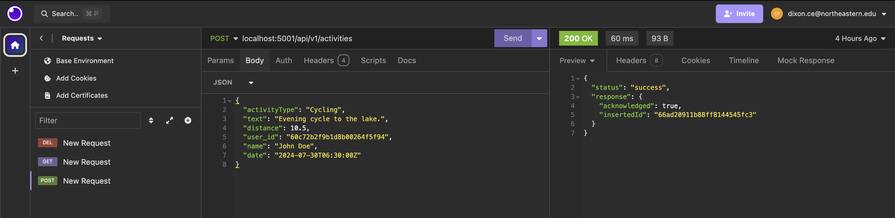
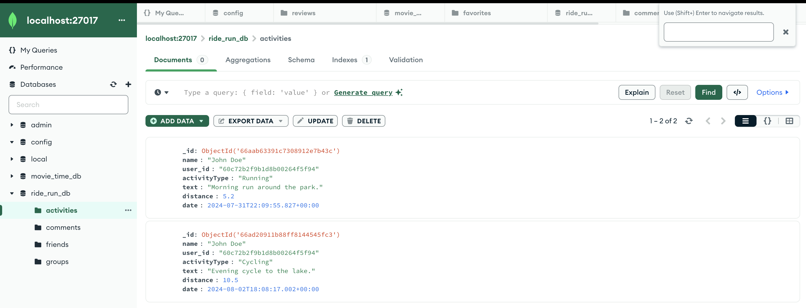

# Run and Ride Web App
The purpose of Run and Ride is to give users the opportunity to make friends and organize sports outings with those around them. When completed a user will have a newsfeed of friend activities and will be able to make posts encouraging other users to RSVP to their runs/rides. Users will also have the capability to like, comment, make groups, and post their own solo/group rides.

## Iteration 1 - Backend
I am working alone on the final project so all progress has been completed by Cecelia Dixon. For iteration 1 of the final project I configured MongoDB and implemented activitiesDAO.js, activities.controller.js, commentsDAO.js, and comments.controller.js. I tested all of these with insomnia and MongoDB's desktop to determine if they were working properly.

Activities will act as a newsfeed post with all the data about a user's ride or run. I haven't decided yet if a user is creating an event to RSVP to if this will be in a different collection or if I will add more fields to activities. Comments works by using an object id for an activity to allow the user to comment on a specific newsfeed item.

I configured the backend routes and they seem to be working properly at the time. I initially ran into some issues with this, but found some typos in my code that allowed me to progress after I fixed them.

In the future I need to make functionality in the backend for user friendship connections. I also may need to update activities to hold more data about athletic activities or to have a space for images.

### Screenshots

